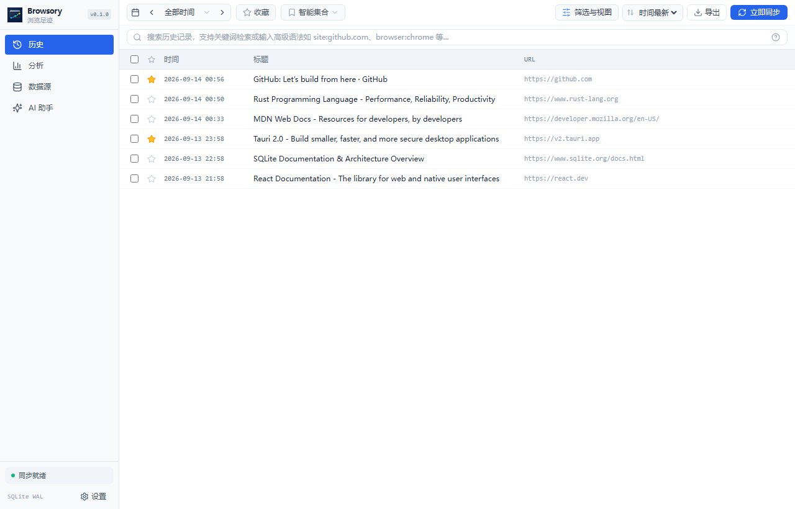
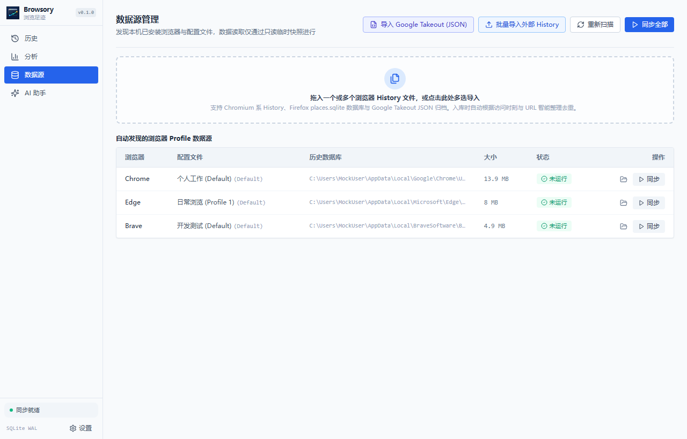
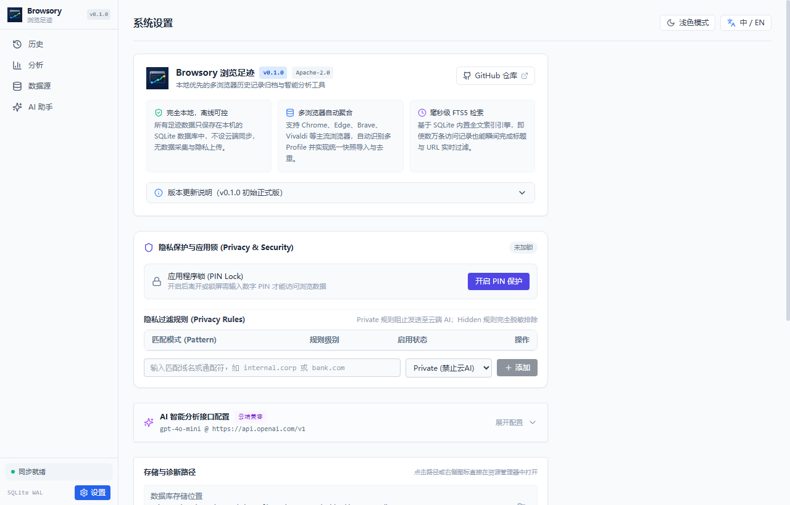

<div align="center">


# Browsory 浏览足迹

**本地优先的多浏览器历史记录归档、智能检索与数据分析桌面应用**

[](./LICENSE)
[](https://github.com/rowanjove/browsory/releases)
[]()
[](https://v2.tauri.app)

[English](./README_EN.md) · **简体中文**

</div>

---

## 💡 为什么需要 Browsory？

日常在不同浏览器（Chrome、Edge、Brave 等）之间切换时，浏览历史往往分散在各自的数据目录中，不仅难以统一检索，浏览器自身自带的历史记录界面也往往功能单一、保存期限有限，且搜索大体量记录时容易卡顿。

**Browsory** 旨在解决这些问题。它是一个完全运行在本地的桌面应用，自动发现并聚合多浏览器的历史足迹，提供毫秒级全文搜索、可视化数据分析看板、PIN 码隐私保护，并支持接入本地或私有大模型进行足迹智能回顾。

---

## ✨ 核心特性

- **🔒 本地优先，隐私完全自控**
  所有历史数据全生命周期存储在您本机的 SQLite 数据库中。没有云端服务器，没有静默收集，不上传任何历史记录或分析数据。
- **🌐 多浏览器自动发现与快照聚合**
  自动识别系统安装的 Chromium 内核浏览器（Chrome、Edge、Brave、Vivaldi 等）及其多个 Profile，采用只读临时快照复制机制读取，在浏览器运行时也能平稳同步，绝无数据库死锁问题。
- **⚡ 毫秒级 FTS5 全文搜索**
  内置 SQLite FTS5 全文检索引擎，即使归档数万条记录，也能在键入关键字时瞬间过滤网页标题与 URL，支持多条件交叉组合筛选。
- **📊 行为洞察与多维统计看板**
  提供访问量趋势折线、24 小时活跃时段热力图、顶级域名占比与新探索网站统计，直观呈现个人探索轨迹。
- **🤖 可选的本地 / 云端 AI 智能回忆**
  支持直连本地运行的 Ollama 模型或兼容 OpenAI 规范的私有接口，基于检索到的真实足迹进行问答回顾，默认断网离线，配置完全由您掌握。
- **🛡️ PIN 码安全锁与防暴力保护**
  支持设置数字 PIN 码安全锁，离开自动上锁，并内置防暴力破解的指数退避冻结策略。
- **📦 数据导入与归档导出**
  支持导入 Google Takeout 导出的历史记录 JSON 归档，支持拖拽外部 SQLite 历史文件批量同步，并可随时导出为 CSV / Excel 备份。

---

## 📸 界面预览

### 1. 历史足迹检索 (History)
毫秒级全文模糊检索、收藏夹与多维条件过滤：


### 2. 统计与行为洞察 (Analytics)
总访问量、活跃天数、每日趋势、访问时段热力图与域名分布：


### 3. 数据源管理 (Sources)
自动扫描识别已安装的浏览器与 Profile 配置，支持一键增量同步与外部导入：


### 4. AI 智能回忆 (AI Assistant)
基于本地真实足迹的上下文问答与历史回顾：


### 5. 系统设置与关于 (Settings & About)
外观偏好、PIN 码保护、大模型接口设置与版本更新说明：


---

## 🛠️ 技术架构

Browsory 采用现代轻量级跨平台架构，追求极低资源占用与高执行性能：

- **桌面底座**：[Tauri v2](https://v2.tauri.app/)（原生轻量系统 WebView，内存占用极小）
- **后端内核**：[Rust](https://www.rust-lang.org/)（原生并发、内存安全、高性能数据解析）
- **数据库引擎**：[SQLite 3](https://www.sqlite.org/)（结合 WAL 模式与 FTS5 全文检索引擎）
- **前端框架**：[React 18](https://react.dev/) + [TypeScript](https://www.typescriptlang.org/) + [Tailwind CSS](https://tailwindcss.com/) + [Zustand](https://github.com/pmndrs/zustand)

---

## 📥 下载安装

前往 [Releases 页面](https://github.com/rowanjove/browsory/releases) 下载最新版本的安装程序：

- **Windows 安装引导包**：`Browsory_0.1.2_x64-setup.exe`
- **Windows MSI 安装包**：`Browsory_0.1.2_x64_en-US.msi`
- **绿色便携版压缩包**：`Browsory_0.1.2_x64_portable.zip`（解压即用。目录内需保留 `portable.txt`，数据写在程序旁 `data\` 目录）

---

## 🏗️ 源码构建

如果您希望从源码编译项目，请确保本机已配置以下环境：

- [Node.js](https://nodejs.org/) (>= 18) 与 [pnpm](https://pnpm.io/)
- [Rust](https://www.rust-lang.org/tools/install) (>= 1.77.2)
- Visual Studio C++ 构建工具（Windows 环境）

```bash
# 1. 克隆代码仓库
git clone https://github.com/rowanjove/browsory.git
cd browsory

# 2. 安装前端依赖
pnpm install

# 3. 运行本地开发调试
pnpm tauri dev

# 4. 构建生产 Release 包
pnpm tauri build
```

构建生成的安装包位于 `src-tauri/target/release/bundle/` 目录下。

---

## 🔒 隐私与安全性

1. **绝对本地化**：默认不连接官方服务器。安装版数据在用户 AppData；便携版（程序旁有 `portable.txt`）写在程序目录的 `data\`。详见 [隐私说明](./docs/PRIVACY.md)。 PIN 只锁定界面，不会加密 `archive.db`。
2. **只读保护**：扫描与导入浏览器数据时，仅对源文件建立只读临时副本，不会修改、删除或污染浏览器本身的任何记录。
3. **敏感规则过滤**：支持自定义敏感域名正则规则（Private / Hidden），命中规则的记录在接入 AI 分析时自动被剥离或在界面脱敏展示。

---

## 📄 开源许可证

本项目基于 [Apache-2.0 License](./LICENSE) 协议开源。欢迎提交 Issue 与 Pull Request。
