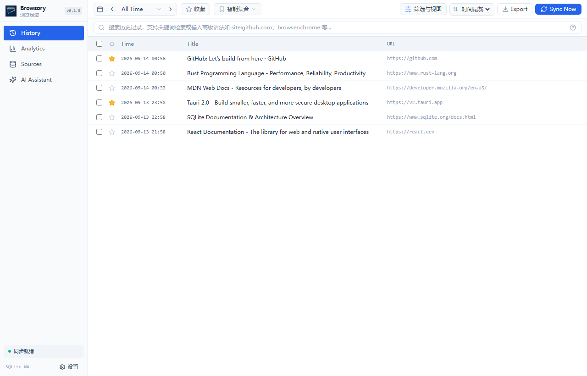
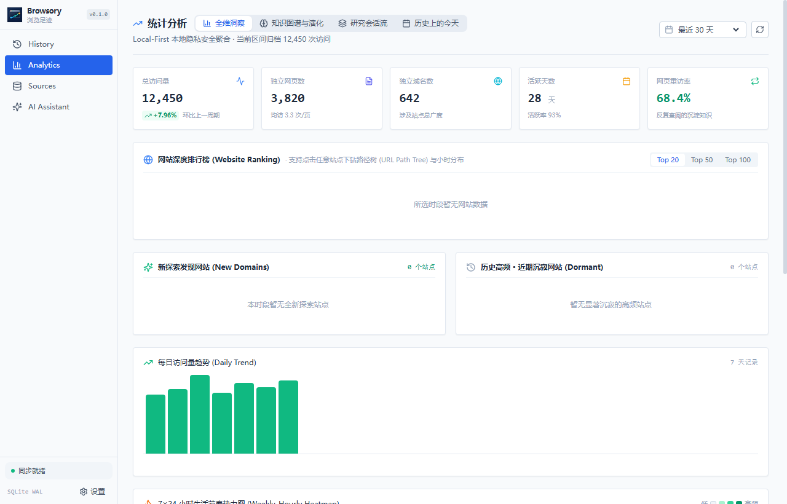
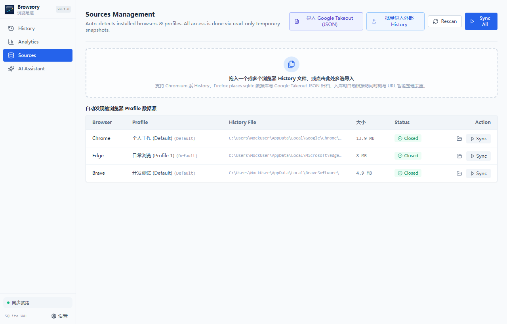
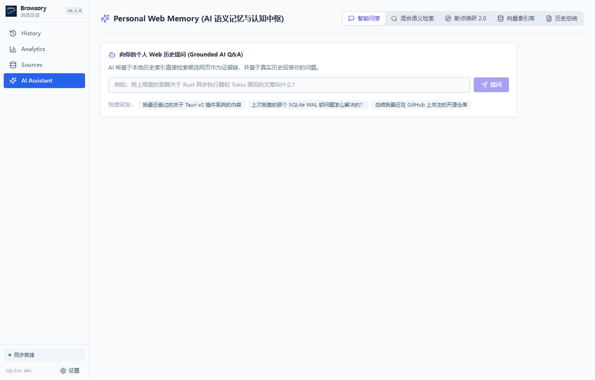
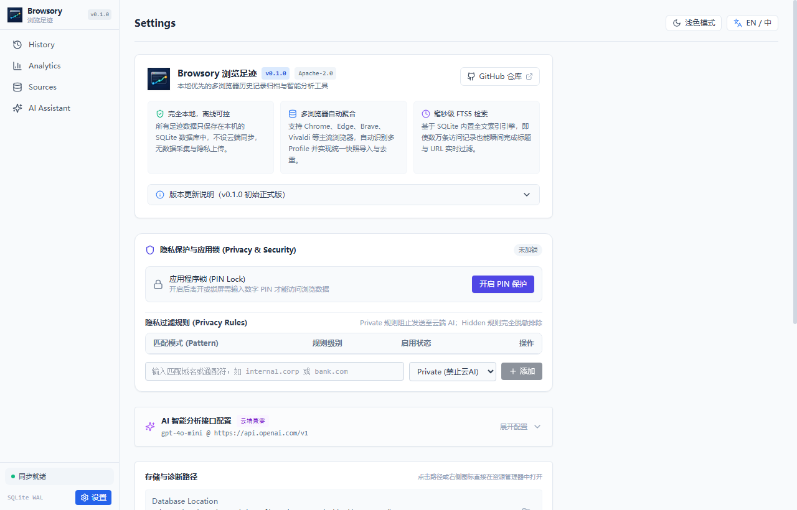

<div align="center">


# Browsory

**Local-first multi-browser history archive, instant search, and analytics desktop application**

[](./LICENSE)
[](https://github.com/rowanjove/browsory/releases)
[]()
[](https://v2.tauri.app)

**English** · [简体中文](./README.md)

</div>

---

## 💡 Why Browsory?

When using multiple web browsers (Chrome, Edge, Brave, etc.), browsing history is fragmented across different profile directories. Built-in history viewers are often slow to search through large datasets, lack unified aggregation, and offer limited analytics.

**Browsory** solves this by providing a unified, local-first archive. It automatically discovers multi-browser profiles, enables millisecond-level full-text search, delivers visual browsing analytics, secures your data with a PIN lock, and optionally connects to local or private LLMs for intelligent history recall.

---

## ✨ Key Features

- **🔒 Local-First, Complete Privacy**
  All historical data remains entirely in a local SQLite database on your machine. No telemetry, no cloud servers, and no background tracking.
- **🌐 Multi-Browser Auto-Discovery & Snapshot Aggregation**
  Automatically detects Chromium-based browsers (Chrome, Edge, Brave, Vivaldi, etc.) across multiple user profiles. Reads data via read-only temporary snapshots to avoid database locks while browsers are running.
- **⚡ Millisecond-Level FTS5 Full-Text Search**
  Powered by SQLite FTS5 full-text indexing. Instantly filters through tens of thousands of visit records by keyword, title, domain, or time range.
- **📊 Behavioral Insights & Analytics Dashboard**
  Visualizes visit trends, 24-hour activity heatmaps, top domain distributions, and discovery stats.
- **🤖 Optional Local / Cloud AI Memory Assistant**
  Connects to local Ollama instances or custom OpenAI-compatible endpoints to answer questions based on your browsing history. Completely offline by default.
- **🛡️ PIN Security Lock**
  Enforce access control with a master PIN lock, idle auto-lock, and exponential backoff protection against brute-force attempts.
- **📦 Data Portability & Archive Import/Export**
  Import Google Takeout JSON archives, drag-and-drop external SQLite history databases, and export records to CSV or Excel anytime.

---

## 📸 Screenshots

### 1. History & Instant Search
Full-text search, favorites, and multi-facet filtering:


### 2. Analytics & Visual Insights
Visits overview, daily trends, hourly heatmaps, and domain rankings:


### 3. Sources & Multi-Browser Sync
Auto-scanned browser profiles, snapshot synchronization, and batch import:


### 4. AI History Memory Assistant
Contextual questions and memory summaries grounded in your local visits:


### 5. Settings & About
Theme, PIN security, LLM endpoint configuration, and release details:


---

## 🛠️ Architecture

- **Desktop Framework**: [Tauri v2](https://v2.tauri.app/) (Lightweight system webview, minimal memory footprint)
- **Core Engine**: [Rust](https://www.rust-lang.org/) (Memory safety, native performance, multi-threaded parsing)
- **Database**: [SQLite 3](https://www.sqlite.org/) (WAL mode + FTS5 full-text search)
- **Frontend Stack**: [React 18](https://react.dev/) + [TypeScript](https://www.typescriptlang.org/) + [Tailwind CSS](https://tailwindcss.com/) + [Zustand](https://github.com/pmndrs/zustand)

---

## 📥 Download & Installation

Visit the [Releases Page](https://github.com/rowanjove/browsory/releases) to download the latest builds:

- **Windows Setup Installer**: `Browsory_0.1.2_x64-setup.exe`
- **Windows MSI Package**: `Browsory_0.1.2_x64_en-US.msi`
- **Portable ZIP**: `Browsory_0.1.2_x64_portable.zip` (Keep `portable.txt` next to the executable; data is stored in a sibling `data` folder)

---

## 🏗️ Building from Source

Prerequisites:
- [Node.js](https://nodejs.org/) (>= 18) and [pnpm](https://pnpm.io/)
- [Rust](https://www.rust-lang.org/tools/install) (>= 1.77.2)
- Visual Studio C++ Build Tools (Windows)

```bash
# Clone the repository
git clone https://github.com/rowanjove/browsory.git
cd browsory

# Install frontend dependencies
pnpm install

# Run in development mode
pnpm tauri dev

# Build production release package
pnpm tauri build
```

The compiled binaries and installers will be generated under `src-tauri/target/release/bundle/`.

---

## 🔒 Privacy Guarantee

1. **No Telemetry**: No user analytics or tracking code is included.
2. **Read-Only Ingestion**: Access to browser SQLite files is strictly performed on temporary copies, never altering original browser data.
3. **Sensitive Rule Filtering**: Users can configure custom pattern rules (Private / Hidden) to strip or mask URLs before displaying or passing them to the AI prompt context.

---

## 📄 License

This project is licensed under the [Apache-2.0 License](./LICENSE). Contributions and feedback are welcome!
